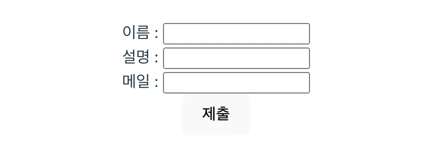
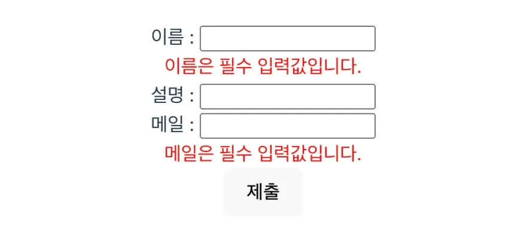

## ASAC 07기 React 기본 실습

### Work 02

#### 레벨업 버튼을 눌렀을때 레벨업이 되고, 15레벨에서 `1차 전직`, 30레벨에서 `2차 전직` 하라

- SetState 사용법 2가지 모두를 사용해보아라

---

### Work 03

#### 입력된 나이값에 따라서 19세를 기준으로 성년과 미성년을 나누어 각자 달리 하단에 표기

- SetState 사용법 2가지 모두를 사용해보아라

---

### Work 04

앞선 `state` 와 `setState` 예시에서 `count` 와 `button` 두 개 각각 컴포넌트 만들어보자

- 아래의 코드에서 `count` 를 포함한 `
` 를 리액트 함수형 컴포넌트로 만들어라
- 아래의 코드에서 `<button>` 를 리액트 함수형 컴포넌트로 만들어라 1. 증가 버튼과 감소 버튼 각각 다른 컴포넌트로 만들어라 2. 단일 버튼 컴포넌트를 만들어서 각각 증가와 감소 버튼으로 활용해보아라

---

### Work 05

#### 앞선 실습 3 에 이어 19세 기준 미성년자 / 성년 에 따른 놀이공원 입장료 변경 로직 추가

- 처음에는 여러분들이 생각하는 최선의 방법으로 개발해보아라
- 두번째에는 여러 State 상태를 하나의 State 상태로 바꾸어서 객체로 조작하라
- 아래 코드를 보면 알겠지만 하나의 State 는 하나의 값을 관리하고 있을뿐이다.

---

### Work 06

#### 아래 비순서와 순서 리스트를 리스트 아이템 레벨까지 세부적으로 컴포넌트화하라

- 컴포넌트화가 끝났다면 아래와 같은 유저 정보를 모두 표시하도록 리스트 아이템 컴포넌트도 바꾸자
- 리스트 아이템을 클릭했을때 아래와 같이 `<input>` 태그가 표기되도록 하라
- 입력하려고 시도했을때 클릭으로 인지되어 `<input>` 태그가 사라지는 덤앤더머가 될 것이다.
- 이걸 해결하기 위해서는 무엇을 해야할까? 배웠던 내용을 상기해본 뒤 해결하라.
- 그 다음 `<input/>` 폼 입력 완료 후 Enter 키보드 입력 시, 다시 컨텐츠가 표기되도록하라

---

### Work 07

#### Enter 키보드가 아닌 확인/취소 버튼을 통해 수정한 내용을 적용할지말지 선택 가능하도록 하자

---

### Work 09

#### 앞 실습에서 `<input>` 값을 State 상태가 아닌 Ref 사용하여 불필요한 리렌더링을 방지하라

- 입력된 나이값에 따라서 19세를 기준으로 성년과 미성년을 나누어 각자 달리 하단에 표기

---

### Work 10

#### 불필요한 리렌더링 없는 Validation 을 갖춘 이름 / 설명 / 메일 폼 제출 페이지를 만들어라

- 가장 먼저 이것저것 생각하지말고 최소한 불필요한 리렌더링 없이 동작되는 형태로 개발하라
- 그 다음 단일 컴포넌트를 재활용 가능토록 + Validation 도 파라미터로 선택가능하도록 만들어라
  
  
